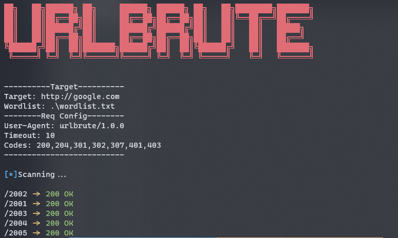
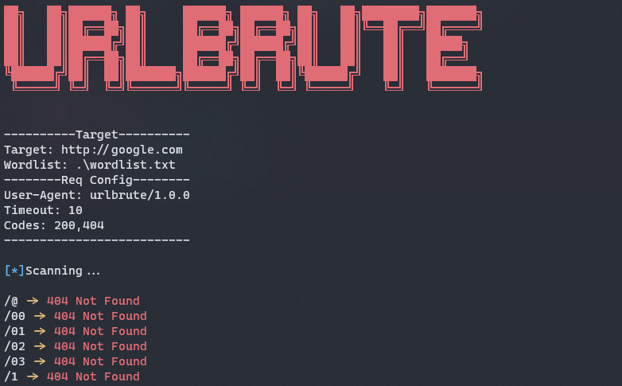

<h1 align="center">URLBrute</h1>
<p align="center">Tool for brute-force directories on websites</p>
<p align="center"></p>

## Avaliable Modes
- Directory/File brute-force

## Installation
### Building from Source
- Install dependencies
```bash
go get
```

- Build executable
```bash
go build
```

- If you want to install in the `$GOPATH/bin` folder
```bash
go install
```

### Using `go get`
```bash
go get github.com/ReddyyZ/URLBrute-GO
```

---

## Help
### Global
```bash
urlbrute --help

Tool for brute-force directories on websites

Usage:
   urlbrute {flags}
   urlbrute <command> {flags}

Commands:
   dir
   help                          displays usage informationn
   version                       displays version number

Flags:
   -h, --help                    displays usage information of the application or a command (default: false)
   -v, --version                 displays version number (default: false)
```

### `Dir`
```bash
urlbrute dir --help

Scan for diretories on website

Usage:
   urlbrute {flags}

Flags:
   -c, --code                    Filter results by status codes (default: 200,204,301,302,307,401,403)
   -h, --help                    displays usage information of the application or a command (default: false)
   -i, --interval                Interval between requests in ms (default: 300)
   -t, --timeout                 Request timeout (default: 10)
   -u, --url                     URL to scan
   -a, --useragent               Set User-Agent (default: urlbrute/1.0.0)
   -w, --wordlist                Wordlist to test
```

---

## Examples
- Default options
```bash
urlbrute dir -u google.com -w common.txt
```


- Showing 404 status code
```bash
urlbrute dir -u google.com -w common.txt --code 200,404
```


- Changing user-agent
```bash
urlbrute dir -u google.com -w common.txt --useragent useragent/1.0
```


---

<h2 align="center">&lt;/&gt; by <a href="https://github.com/ReddyyZ">ReddyyZ</a></h2>