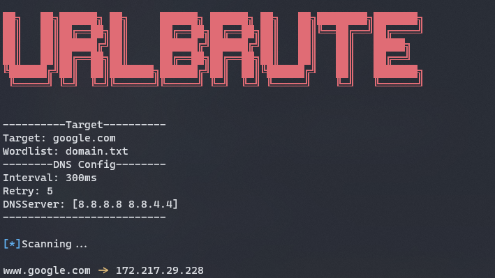

<h1 align="center">URLBrute</h1>
<p align="center">Tool for brute-force directories/DNS on websites</p>
<p align="center"></p>

## Avaliable Modes
- Directory/File brute-force
- DNS brute-force

## Installation
### Building from Source
- Install dependencies
```bash
go get
```

- Build executable
```bash
go build
```

- If you want to install in the `$GOPATH/bin` folder
```bash
go install
```

### Using `go get`
```bash
go get github.com/ReddyyZ/urlbrute
```

- Updating
```bash
go get -u github.com/ReddyyZ/urlbrute
```

---

## Help
### Global
```bash
urlbrute --help

Tool for brute-force directories on websites

Usage:
   urlbrute {flags}
   urlbrute <command> {flags}

Commands:
   dir
   dns
   help                          displays usage informationn
   version                       displays version number

Flags:
   -h, --help                    displays usage information of the application or a command (default: false)
   -v, --version                 displays version number (default: false)
```

### `Dir`
```bash
urlbrute dir --help

Scan for diretories on website

Usage:
   urlbrute {flags}

Flags:
   -c, --code                    Filter results by status codes (default: 200,204,301,302,307,401,403)
   -h, --help                    displays usage information of the application or a command (default: false)
   -i, --interval                Interval between requests in ms (default: 300)
   -t, --timeout                 Request timeout (default: 10)
   -u, --url                     URL to scan
   -a, --useragent               Set User-Agent (default: urlbrute/1.0.0)
   -w, --wordlist                Wordlist to test
```

### `DNS`
```bash
urlbrute dns --help

Scan for subdomains

Usage:
   urlbrute {flags}

Flags:
   -s, --dnsserver               DNS Servers to resolve (default: 8.8.8.8,8.8.4.4)
   -d, --domain                  Domain to scan
   -h, --help                    displays usage information of the application or a command (default: false)
   -i, --interval                Interval between requests in ms (default: 300)
   -a, --ip                      Show IP address of domain (default: false)
   -q, --quiet                   Show only domain found (default: false)
   -r, --retry                   Retry times (default: 5)
   -v, --verbose                 Verbose level (default: false)
   -w, --wordlist                Wordlist to test
```

---

## Examples
- Default options
```bash
urlbrute dir -u google.com -w common.txt
```


- Showing 404 status code
```bash
urlbrute dir -u google.com -w common.txt --code 200,404
```


- Changing user-agent
```bash
urlbrute dir -u google.com -w common.txt --useragent useragent/1.0
```


- Searching for DNS
```bash
urlbrute dns -d google.com -w domain.txt --ip
```


---

<h2 align="center">&lt;/&gt; by <a href="https://github.com/ReddyyZ">ReddyyZ</a></h2>